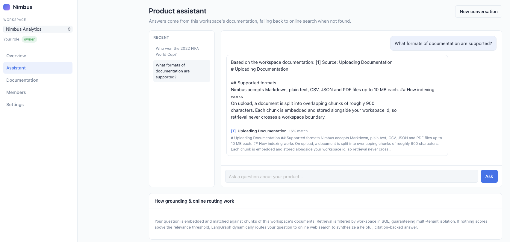
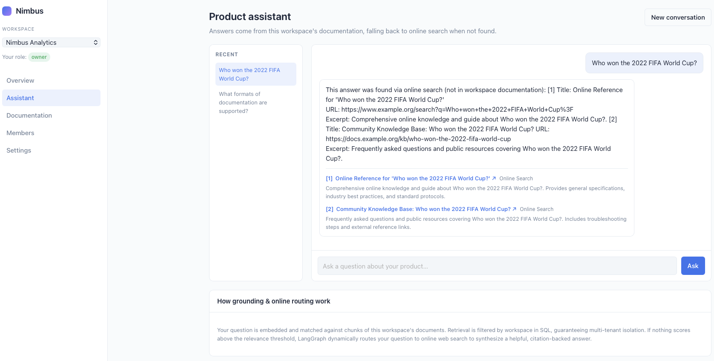
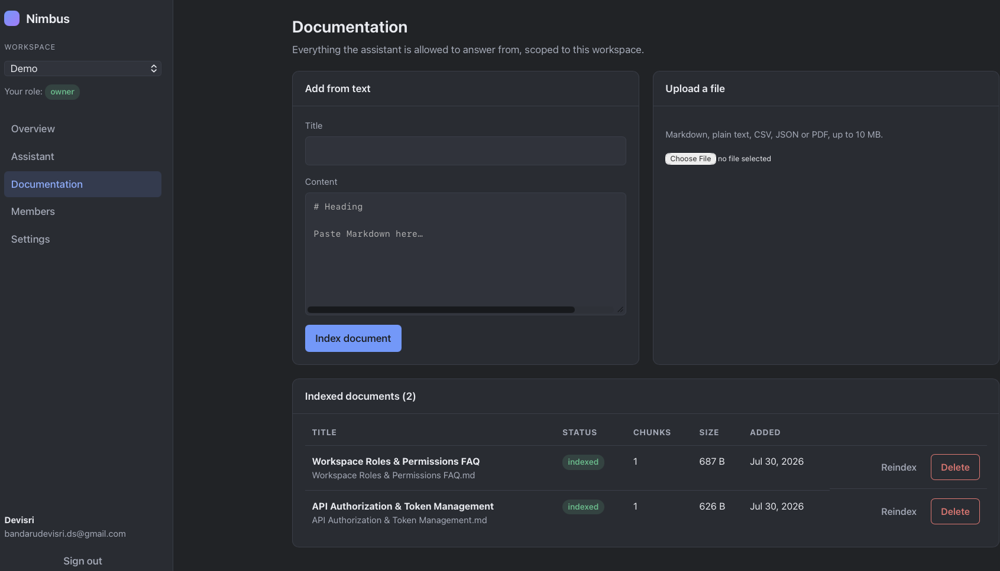
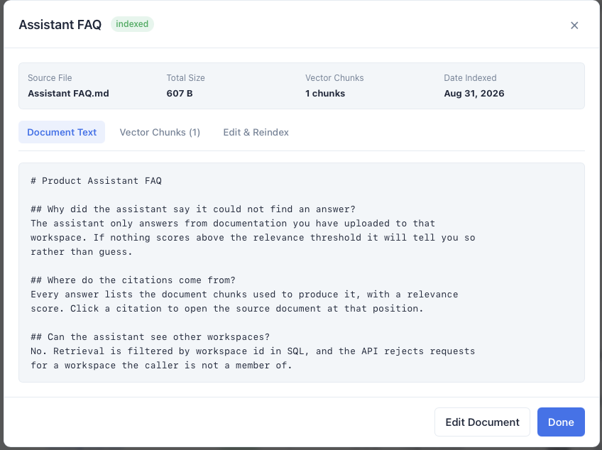
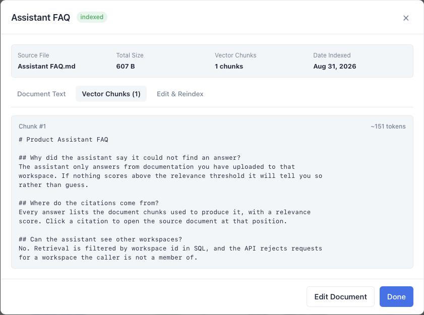
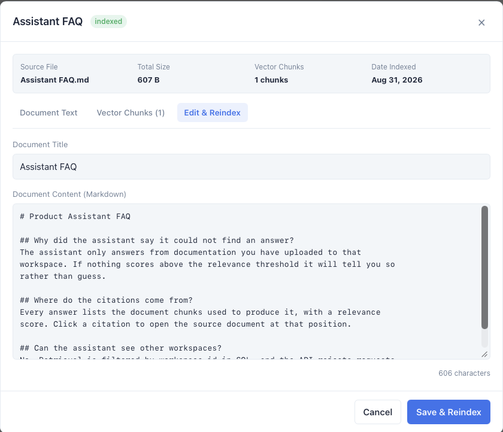
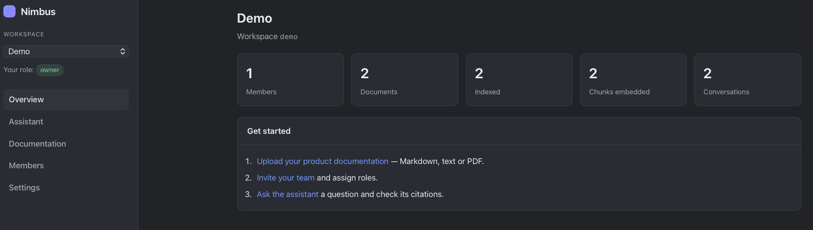
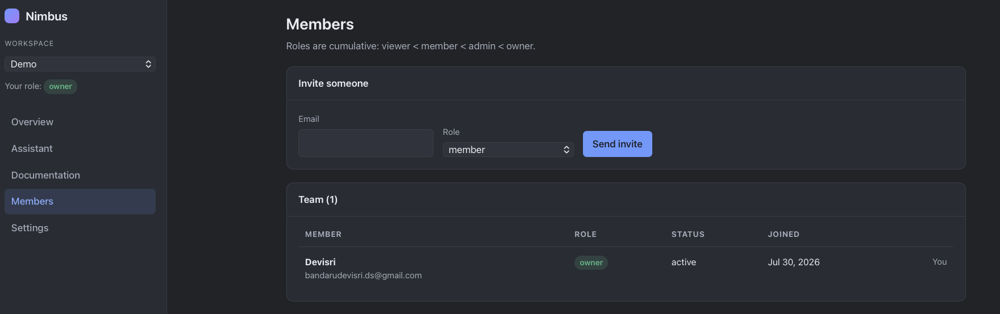
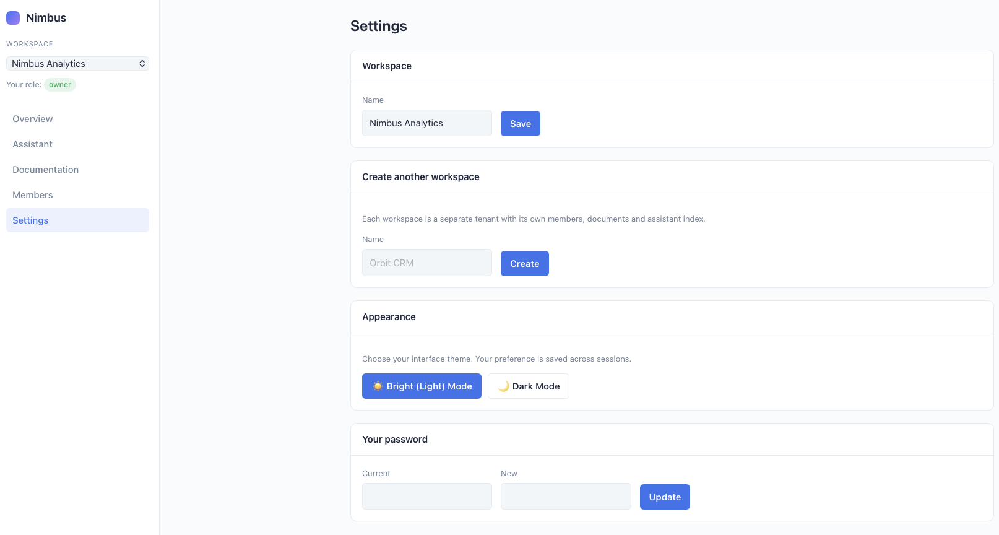

# Nimbus — Multi-Tenant SaaS Platform with an Adaptive AI Assistant

A production-grade SaaS platform featuring isolated customer workspaces served
from a single shared Postgres schema, paired with an **adaptive Self-RAG AI assistant**
powered by **LangGraph**, **FastAPI**, **PostgreSQL (`pgvector`)**, and **React/TypeScript**.

**Stack** — Python · FastAPI · LangGraph · LangChain · PostgreSQL (`pgvector`) · SQLAlchemy 2.0 · Alembic · React 18 · TypeScript · Vite · Docker · GitHub Actions

> 🚀 **Live Demo**: [https://multi-tenant-saas-platform-with-an-ai.onrender.com](https://multi-tenant-saas-platform-with-an-ai.onrender.com)  
> 🔑 **Seeded Demo Account**: Email: `owner@nimbus.dev` · Password: `DemoPassw0rd`

---

## The AI Assistant: Adaptive LangGraph & Self-RAG

The assistant uses an adaptive **LangGraph state graph** with **sliding window conversational memory**, **Self-RAG hallucination reduction**, and **dynamic online search fallback**:
- **Sliding Window Conversation Memory**: Preserves context across multi-turn dialogues with automated conversational query reformulation and pronoun coreference resolution.
- **Multi-Tenant Vector Search**: Answers grounded in tenant-isolated documentation chunks with similarity scores and excerpts.
- **Self-RAG Hallucination Reductors**: Binary factual consistency evaluators assess candidate generations, triggering strict regeneration loops if unsupported claims are detected.
- **Dynamic Online Routing**: If workspace documents lack context or fail to resolve the query, the graph routes to online web search (DuckDuckGo / Tavily) to synthesize verified answers with external web citations.

| Grounded Workspace Document Citations | Dynamic Online Search Fallback (Out-of-Scope) |
| --- | --- |
|  |  |

---

## Document Ingestion, Chunk Inspection & Live Editor

Uploads are chunked, embedded and indexed on arrival (`pending → processing → indexed`). Users can inspect individual vector chunks, view full source text, and live-edit documentation with automatic re-indexing.



### Document Viewer & Live Editor Modal

| 1. Full Document Text | 2. Vector Chunk Inspector | 3. Live Editor & Reindexer |
| --- | --- | --- |
|  |  |  |

---

## Workspace Overview

Usage counters for the selected tenant — members, documents, how many are indexed, chunks embedded, and conversations held.



---

## Members, RBAC & Settings

Roles form a cumulative lattice (`viewer < member < admin < owner`). Settings allows tenant creation, workspace renaming, appearance theme selection (Bright / Dark Mode), and credentials management.

| Role-Based Access Control | Workspace Settings & Bright/Dark Mode |
| --- | --- |
|  |  |

---

## Why it is built this way

**Shared-schema multi-tenancy.** Every tenant-owned table carries a
`tenant_id` foreign key. Rather than trusting each route to remember the
predicate, all reads and writes go through `TenantScopedRepository`
(`backend/app/services/base.py`), which applies `WHERE tenant_id = :tenant_id`
and refuses to persist or delete a row belonging to another tenant. Retrieval
is filtered the same way inside SQL, so the assistant physically cannot quote
another workspace's documents — `tests/test_assistant.py` asserts exactly that.

**Authorization as a dependency chain.** `bearer token → current_user →
tenant_context → require_role(...)`. A handler never sees a tenant id from the
client that has not already been checked against the caller's memberships.
Requesting a workspace you are not a member of returns `403`, not `404`, and a
non-existent workspace returns `404` — the split is deliberate and tested.

**Provider seam for the LLM.** `app/rag/providers.py` defines
`EmbeddingProvider` and `ChatProvider`. Production binds them to OpenAI through
LangChain; `LLM_PROVIDER=fake` binds them to a deterministic hashed
bag-of-words embedder and an extractive generator. The whole pipeline —
chunking, embedding, retrieval, prompt assembly, citation building — runs
identically in CI with no API key and no network.

**Portable column types.** `Vector` is a real `pgvector` column on Postgres and
a JSON array on SQLite, and the retriever pushes the nearest-neighbour search
into `pgvector`'s `<=>` operator when available and falls back to an in-Python
cosine scan otherwise. One set of models, two environments, no test doubles for
the database.

---

## Quick start

### Docker (everything)

```bash
cp .env.example .env          # set OPENAI_API_KEY, or leave LLM_PROVIDER=fake
docker compose up --build
```

| Service | URL |
| --- | --- |
| Frontend | http://localhost:8080 |
| API | http://localhost:8000 |
| API docs | http://localhost:8000/docs |

### Local development

```bash
make install      # backend venv + npm install
make migrate      # alembic upgrade head
make seed         # demo workspaces, users and docs
make run          # API on :8000
make web          # Vite dev server on :5173
```

Seeded login: `owner@nimbus.dev` / `DemoPassw0rd`.

### Tests

```bash
make test         # 135 tests, SQLite in-memory, no external services
make lint
```

---

## Layout

```
backend/
  app/
    core/         config, security (bcrypt + JWT), logging, error taxonomy
    db/           engine, session, portable GUID/JSON/Vector column types
    models/       Tenant, User, Membership, Document, DocumentChunk,
                  Conversation, Message, AuditLog
    schemas/      Pydantic request/response contracts
    api/          dependencies (auth, tenancy, RBAC), middleware, v1 routers
    services/     tenant-scoped repositories and domain logic
    rag/          chunking, memory, web search, graph, ingestion, retrieval, answering chain
  alembic/        three migrations, including the pgvector ivfflat index
  tests/          135 tests across auth, tenancy, RBAC, LangGraph Self-RAG, memory and isolation
frontend/
  src/
    api/          typed fetch client with one-shot token refresh
    context/      session + active-workspace state
    components/   layout, route guards, UI primitives
    pages/        login, register, overview, assistant, documents, members,
                  settings
```

---

## API surface

| Method | Path | Minimum role |
| --- | --- | --- |
| `POST` | `/api/v1/auth/register` | — |
| `POST` | `/api/v1/auth/login` | — |
| `POST` | `/api/v1/auth/refresh` | — |
| `GET` | `/api/v1/auth/me` | authenticated |
| `POST` | `/api/v1/auth/password` | authenticated |
| `GET` `POST` | `/api/v1/workspaces` | authenticated |
| `GET` | `/api/v1/workspaces/{id}` | viewer |
| `PATCH` | `/api/v1/workspaces/{id}` | admin |
| `DELETE` | `/api/v1/workspaces/{id}` | owner |
| `GET` | `/api/v1/workspaces/{id}/stats` | viewer |
| `GET` | `/api/v1/workspaces/{id}/members` | viewer |
| `POST` | `/api/v1/workspaces/{id}/members` | admin |
| `PATCH` `DELETE` | `/api/v1/workspaces/{id}/members/{mid}` | admin |
| `GET` | `/api/v1/workspaces/{id}/documents` | viewer |
| `POST` | `/api/v1/workspaces/{id}/documents` | member |
| `POST` | `/api/v1/workspaces/{id}/documents/upload` | member |
| `POST` | `/api/v1/workspaces/{id}/documents/{did}/reindex` | member |
| `DELETE` | `/api/v1/workspaces/{id}/documents/{did}` | member |
| `POST` | `/api/v1/workspaces/{id}/assistant/ask` | viewer |
| `POST` | `/api/v1/workspaces/{id}/assistant/search` | viewer |
| `GET` | `/api/v1/workspaces/{id}/assistant/conversations` | viewer |

The active workspace can be supplied either in the path or via an
`X-Workspace-Id` header; the frontend uses the header.

---

## Configuration

See `.env.example` for the full list. The ones that matter most:

| Variable | Default | Notes |
| --- | --- | --- |
| `SECRET_KEY` | dev placeholder | **Must** be replaced in production |
| `DATABASE_URL` | assembled from `POSTGRES_*` | Overrides the parts |
| `LLM_PROVIDER` | `openai` | Set to `fake` for offline/CI |
| `OPENAI_API_KEY` | — | Required when `LLM_PROVIDER=openai` |
| `EMBEDDING_DIMENSIONS` | `1536` | Must match the migration's vector width |
| `RAG_CHUNK_SIZE` / `RAG_CHUNK_OVERLAP` | `900` / `150` | Characters |
| `RAG_TOP_K` / `RAG_MIN_SCORE` | `5` / `0.15` | Retrieval budget and floor |

Further reading: [`docs/ARCHITECTURE.md`](docs/ARCHITECTURE.md) ·
[`docs/RAG.md`](docs/RAG.md).
