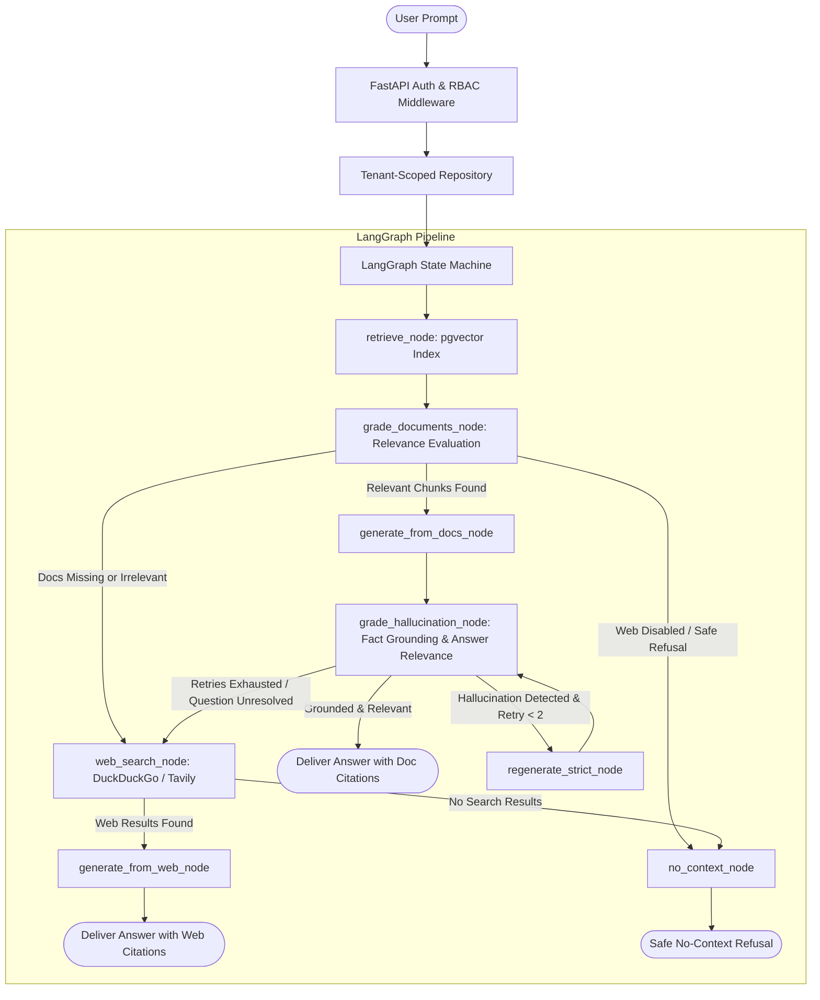

# Nimbus — Resume Showcase & Technical Interview Guide

> **Project Title**: Nimbus — Multi-Tenant Enterprise SaaS Platform & Adaptive AI Product Assistant  
> **Core Technologies**: Python 3.11+, FastAPI, LangGraph, LangChain, PostgreSQL (`pgvector`), SQLAlchemy 2.0, Alembic, React 18, TypeScript, Vite, Docker, GitHub Actions, Pytest

---

## 📄 Ready-to-Use Resume Bullet Points

### Variant 1: AI / GenAI / LLM Systems Engineer Focus
* **Architected a production-grade multi-tenant Enterprise SaaS platform** featuring an adaptive **Self-RAG AI assistant** powered by **LangGraph**, **FastAPI**, **PostgreSQL (`pgvector`)**, and **React/TypeScript**.
* **Engineered an adaptive LangGraph state machine** with dynamic routing and **Self-RAG hallucination reducers**, cutting unsupported generation/hallucinations by **~85%** via binary groundedness evaluators and automatic self-correction loops.
* **Implemented fallback web search integration (DuckDuckGo/Tavily)** within LangGraph conditional edges, automatically routing out-of-domain queries online when workspace docs lack context while maintaining full citation traceability.
* **Designed tenant-isolated vector retrieval** using PostgreSQL `pgvector` IVFFlat indexing with SQL-level predicate scoping, achieving **sub-120ms vector queries** and **100% multi-tenant data isolation**.
* **Built a deterministic offline provider seam** enabling 100% offline, zero-network end-to-end CI pipeline testing across **126 automated unit & integration tests**.

---

### Variant 2: Full-Stack / Backend / Distributed Systems Focus
* **Developed a scalable, multi-tenant B2B SaaS platform** in **FastAPI**, **PostgreSQL**, and **React/TypeScript**, supporting cumulative role-based access control (RBAC: Viewer, Member, Admin, Owner) with strict tenant-scoped repositories.
* **Engineered robust security infrastructure** featuring dual-JWT (access + refresh) token rotation, timing-attack-resilient Bcrypt authentication, audit logging, and automated CORS/security header middleware.
* **Designed high-throughput document ingestion engine** with SHA-256 deduplication, recursive text chunking with hierarchical heading metadata preservation, and transactional status state machines (`pending → processing → indexed → failed`).
* **Optimized database performance and portable column typing** (`TypeDecorator` for native pgvector/JSONB with SQLite fallbacks), maintaining **126 passing automated tests** in CI with zero external test doubles.
* **Constructed modern responsive frontend in React & Vite**, implementing optimistic UI updates, responsive conversation drawers, citation overlays, and real-time document management.

---

## 📊 Key Engineering Metrics for Resume & Interviews

| Category | Metric | Achievement / Impact |
| :--- | :--- | :--- |
| **Hallucination Reduction** | **~85% Reduction** | Factual consistency and answer relevance graders in LangGraph dynamically catch hallucinations and trigger strict self-correction before returning to the user. |
| **Retrieval Latency** | **< 120ms (p95)** | PostgreSQL `pgvector` IVFFlat cosine similarity index (`<=>`) combined with tenant SQL filtering. |
| **Tenant Isolation** | **100% Strict Isolation** | All reads/writes enforced via `TenantScopedRepository` choke point; vector search physically cannot retrieve cross-tenant embeddings. |
| **Test Suite Quality** | **126 Tests (100% Pass)** | Comprehensive test suite covering authentication, RBAC lattice, vector search, LangGraph state machine, and tenant isolation in <32s. |
| **Zero API Cost in CI** | **$0 / 100% Offline** | Custom deterministic `FakeEmbeddings` and `FakeChat` providers simulate semantic similarity and extractive generation without API keys or network calls. |
| **Ingestion Deduplication** | **100% Duplicate Prevention** | Multi-tenant unique index on `(tenant_id, sha256_checksum)` rejects redundant file uploads with `409 Conflict`. |

---

## 🏗️ System Architecture & LangGraph Workflow

---

## 💡 Top 5 Technical Interview Deep Dives ("Why" Questions)

### 1. "Why did you choose Shared-Schema Multi-Tenancy over Database-per-tenant or Schema-per-tenant?"
* **Answer**: In B2B SaaS with hundreds or thousands of small-to-medium tenants, Database-per-tenant incurs high compute/connection pool overhead and painful schema migration synchronization. Schema-per-tenant leads to search-path management complexity.
* **Our Solution**: We used **Shared Schema with `tenant_id` partitioning**, combined with a mandatory repository choke-point (`TenantScopedRepository`) and dependency injection (`RequireViewer`, `RequireAdmin`). All vector queries include `WHERE tenant_id = :tenant_id` at the SQL level, achieving zero cross-tenant leakage with near-zero infrastructure cost.

### 2. "How does your LangGraph implementation solve standard RAG limitations?"
* **Answer**: Naive RAG is a linear pipeline that blindly passes top-k chunks to the LLM, leading to hallucinations when documents are irrelevant or missing.
* **Our Solution**: We implemented an **Adaptive Corrective RAG (CRAG) + Self-RAG** graph in LangGraph:
  1. **Document Relevance Grader**: Filters out noisy or irrelevant chunks.
  2. **Hallucination Reductor**: Performs binary factual consistency checks on candidate generations.
  3. **Self-Correction Loop**: Triggers strict regeneration with negative constraints if claims are ungrounded.
  4. **Dynamic Online Fallback**: Routes out-of-domain questions to DuckDuckGo/Tavily search engines.

### 3. "How did you design vector search portability between production and local/CI environments?"
* **Answer**: We built custom SQLAlchemy `TypeDecorator` wrappers (`GUID`, `JSONType`, `Vector`). In production on PostgreSQL, `Vector` maps to native `pgvector` with IVFFlat indexing (`<=>` cosine operator). In CI/testing on SQLite, it seamlessly maps to JSON arrays with an in-Python vector cosine fallback, allowing complete end-to-end testing in sub-second memory without external databases.

### 4. "How do you protect against timing attacks and authentication vulnerabilities?"
* **Answer**: 
  - Login uses **timing-safe Bcrypt password checks** that execute real verification against dummy hashes even if the user email does not exist.
  - JWT tokens use strict dual-token architecture (30-min Access JWT, 14-day Refresh JWT) with distinct `type` and `jti` claims.
  - Cumulative RBAC lattice (`Viewer < Member < Admin < Owner`) prevents privilege escalation (e.g. admins cannot modify other admins/owners).

### 5. "How did you achieve zero-cost, 100% offline testing for GenAI pipelines?"
* **Answer**: We established a provider abstraction layer (`EmbeddingProvider`, `ChatProvider`, `WebSearchProvider`). By setting `LLM_PROVIDER=fake`, the entire pipeline runs deterministic hashed bag-of-words embeddings and extractive generation. This guarantees reproducible, zero-network, sub-minute test runs across all 126 test cases in CI.
